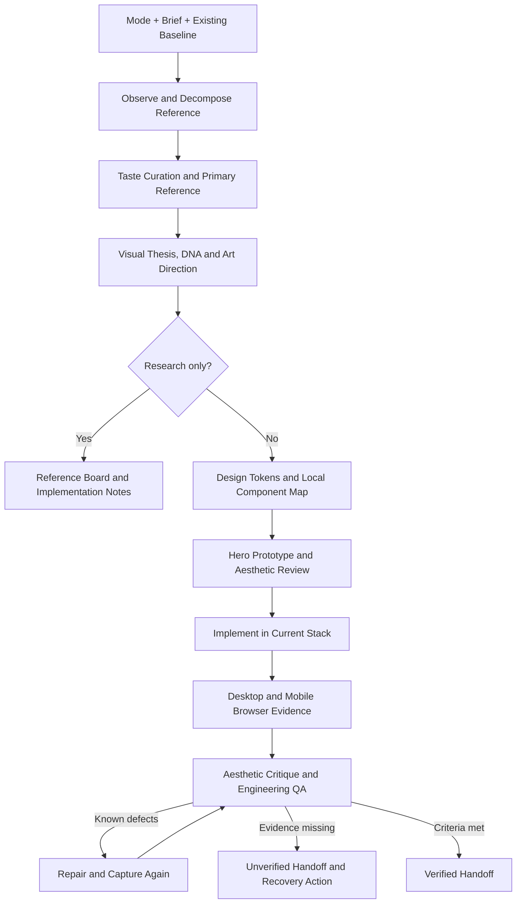

# UI Reference to Code Skill v3.0 — Aesthetic Director

将截图、网站、Pinterest / Behance / Figma 等 UI 参考，转成设计规格、设计系统、组件计划、代码和浏览器视觉修复。适用于 Codex 的参考研究、页面制作与已有项目改版。

**Reference → Art Direction → Composition → Code → Aesthetic Review → Evidence QA**

v3.0 在现有工程流程之前加入参考质量筛选、一个主参考、Visual Thesis、Aesthetic DNA 和构图/字体/素材/节奏决策；视觉 landing page 先做首屏再扩展。审美评审独立于 Fidelity 和机器 QA，工程通过不能证明页面有记忆点。原有 Evidence、schema、Python helpers 与 CI 继续复用。

例如“为 AI Agent 做首页”：先明确“巨型编辑式标题 + 一张主导工作流画面 + 紧凑技术标签”的方向，再原型 Nav/Hero/过渡并查看桌面与手机，发现比例、素材或节奏丢失时先修构图。完整示例见 [aesthetic-direction.md](examples/aesthetic-direction.md)；它是方向示例，实际项目要重新选择。

## 一键复刻（v3.4）

```text
$ui-reference-to-code
复刻这个 Pinterest 作品的首屏：<Pin 链接或截图>。要 3D 特效，品牌叫 Nocturne。
```

流程：取参考 → Replica Card → `scripts/replica_init.py` 生成可运行的 R3F 脚手架 → 实现首屏 → `scripts/capture.mjs` 取桌面/手机证据 → Wow Gate 打分返工。细则见 [Wow Playbook](references/wow-playbook.md)，模板见 [templates/r3f-hero](templates/r3f-hero/README.md)。

## 能做什么

- 按用户范围选择研究、截图实现、网站借鉴或已有 UI 改版，并叠加高保真 / 原创灵感模式。
- 测量或估计布局、字体、颜色、形状、图像、交互与动效，说明证据和未知项。
- 将规格转成 tokens 与 `Reference Element → Local Component → Implementation` 映射。
- 适配当前 HTML/CSS/JS、React、Next、Vue、Nuxt、Svelte、Astro 及实际组件库。
- 保留内容、真实数字、API、路由、数据与产品能力说明。
- 实现后查看桌面和手机，比较、分级、修复再截图；缺证据时如实报告 unverified。

它提供可执行工作流、输出契约和 QA 报告判定脚本。浏览器驱动及设计 / MCP 工具来自运行环境。

## Installation

首次安装到未存在的技能目录：

```sh
# Codex
git clone https://github.com/Joho6666/ui-reference-to-code.git ~/.codex/skills/ui-reference-to-code
# Claude Code
git clone https://github.com/Joho6666/ui-reference-to-code.git ~/.claude/skills/ui-reference-to-code
```

一键复刻额外需要 Node 18+（模板与 `scripts/capture.mjs`；截图需 `npm i -D playwright`）。

已有同名目录时先核对来源和本地改动；从本仓库 clone 的安装可使用 `git pull --ff-only` 更新。若技能列表尚未刷新，开始新的 Codex 对话或重启应用。

Run / Evidence helpers and QA gate use Python 3 standard library. Optional image diff uses Pillow (`pip install -r requirements-visual.txt`). It does not install a browser, MCP or component library.

## Supported Inputs

截图、网页精确 URL、Pin / Behance 项目、可访问 Figma 稿件、现有代码项目、旧设计记录，以及“参考这个页面帮我重做 / 继续优化”等任务。

截图必须实际可查看；设计节点、网页和登录权限不足时记录范围。只给一张图且没有行动要求时，先确认用途。

## Modes

| 模式 | 用途 | 主要输出 |
| --- | --- | --- |
| A Reference Research | 只研究参考 | Reference Board、Design Language、Reusable Patterns、Implementation Notes |
| B Screenshot to Code | 从截图制作 | Reference Design Spec、tokens、component map、代码及比较 |
| C Website Reference | 观察网站规律 | 桌面 / 手机 / 状态规格、适配实现与比较 |
| D Existing Redesign | 现有项目升级 UI | 保留基线、组件复用、代码与相关功能 / 视觉检查 |
| E Pixel Fidelity | B/C/D 的高保真修饰 | 匹配条件的参考 / 实现差异报告 |
| F Inspiration | B/C/D 的原创灵感修饰 | 主参考统领、局部归因、具体原创方向 |

已有目标项目选 D 并保留截图 / 网站来源。只研究优先于实现；“继续”先读 record 并核对代码。E/F 是修饰项，可作用于不同区域，冲突时明确当前目标。

无参考新建先按 brief 提出方向并标注 reference pending；创建实际项目后用 D 跟踪本任务新建页面与内容基线。具体路由见 [task-modes.md](references/task-modes.md)，不虚构网站或截图来源。

## Examples

```text
$ui-reference-to-code
帮我找几个适合作品集的参考，不需要写代码。
每条给具体来源、可借鉴规则、适用区域和实现成本。
```

```text
$ui-reference-to-code
这是截图，帮我尽量还原。先拆布局与字体，再生成 tokens 和组件树，
实现后用桌面和手机浏览器对照，修复重要偏差。只本地预览。
```

```text
$ui-reference-to-code
参考 Linear 的首页，把这个现有 Vue 项目做得更现代，但不要复制。
保留现有内容、API、链接和搜索功能；沿用当前栈与可复用控件。
```

```text
$ui-reference-to-code
继续优化上一次的页面，先读取 .ui-design/record.md，
核对当前代码和剩余 QA 问题，再完成最重要的一项修复。
```

## Workflow



实现模式经过 Visual QA Loop。初检后支持 2–3 轮有依据的修复；已满足条件可提前完成。关键维度低于 7/10、缺观察证据或 Critical/Major 未解决，都不能标记视觉完成。

## Tool Integrations

| 工具 | 何时使用 |
| --- | --- |
| 浏览器 / ego-browser | 来源观察、截图、交互和 responsive 检查 |
| frontend-design | 视觉方向、构图与排版 |
| ui-ux-pro-max | UX 和 design-system 辅助 |
| Semi MCP | 实际组件版本的 API / 状态 / 示例 |
| ECharts | 有清晰问题和真实数据 / 关系时 |
| Spline | 实时 3D 明确产生价值时；保留静态替代 |
| Figma | 用户提供稿件或要求设计稿 / 系统迁移时 |

设计工具和 MCP 可选。使用实际可用 schema 与版本；缺 MCP 可用官方资料或现有控件，验证画面仍需浏览器证据。安装、调用、集成和成功渲染分别记录。

## Example Output

下面展示输出结构；数值是演示，不是对任何真实网站的测量或评分。

```text
Route: D / screenshot / [E] / resume:false / homepage hero
Reference Design Spec: ~1200px container, estimated from the supplied viewport
Design Tokens: container, gutter, typography, surface, accent, radius
Component Map: reference CTA → existing Button → project variant
Visual Difference Report:
  Major V1: title wraps to 3 lines instead of 2; fix width/font and recheck
  Minor V2: border radius differs slightly
Fidelity: responsive 6/10 based on mobile observation → needs-repair
```

尺寸会标 measured / estimated / unknown；静态图不会产生虚构动效时长。无浏览器时分数和画面保持未验证，不能以构建成功替代它。

## Before / Reference / After 案例

| Before | Reference | After（已有 JOHO v1 实践，非 v2 新测试） |
| --- | --- | --- |
| 只覆盖视频复刻与批量剪辑 | 浅色作品集与指定 Pinterest 动效 | 扩展六个能力方向与真实项目 |
| 视觉与作品组织缺少统一方向 | 大字首屏、胶囊导航、作品构图 | 原创手部视觉、精选作品与项目浏览路径 |
| 项目较多、查找困难 | 组件状态与数据可视化资料 | 原生搜索 / 分类、真实标签计数与按需图表 |

详见 [JOHO case study](references/joho-case-study.md)。旧实践的浅色截图异常仍是未解决记录；这里没有编造 Before/After 图片或 v2 网站验证。

## State and Design System

多轮工作保存 `.ui-design/record.md`。只有复杂度需要时才拆分 brief、references、design-system、component-map、implementation-plan 和 qa。多个同源页面复用一次提炼的 tokens，保留页面变体。

## Evidence and Verification

Each QA artifact lives under `.ui-design/runs/<run-id>/`. The gate verifies local file bytes, PNG parsing and viewport/DPR, selected source fingerprints, named artifact references, preservation results and repair captures. Scores and actual image observation remain Agent/human judgements. The [contracts](schemas/contracts.json) and [browser workflow](references/browser-validation.md) define the data format.

## Verification and Development

```sh
python3 -m unittest discover -s tests -v
python3 scripts/qa_gate.py /path/to/qa.json
```

QA v2 结构见 [browser-validation.md](references/browser-validation.md) 与 [JSON contracts](schemas/contracts.json)。退出码为 0 verified、1 needs-repair、2 unverified、3 invalid-report。Gate 会核验本地文件和采样条件；视觉评分和观察仍由 Agent / 人工完成。

[行为场景](references/test-cases.md) 包含至少五个用户请求及失败信号。模型 dry-run、隔离代码执行、真实浏览器执行分别记录，不能相互替代。

## Limitations

- 定量拆解和评分由 Agent 依据实际观察完成，不保证自动像素级复刻。
- 无浏览器、源参考受限或字体 / 资源不可用时，完成可审阅部分并报告未验证条件。
- 浏览器由宿主环境提供；可选 Pillow diff 只报告像素变化，不判定设计质量。
- 不能仅靠高分证明质量；关键功能、真实内容和实际截图同时影响完成状态。
- 部署遵循当前任务授权与托管工作流，研究模式不扩大到发布。

## Repository Structure

```text
SKILL.md                         # concise workflow entry point
agents/openai.yaml               # discoverable skill metadata
references/
  task-modes.md                  # modes, precedence, input/output
  aesthetic-intelligence.md      # curation, thesis, DNA, essence, safe-design cues
  art-direction.md               # composition, typography, imagery, rhythm, hero-first
  aesthetic-review.md            # separate aesthetic judgement and polish loop
  polish-loop-playbook.md        # mandatory structure/material/behavior repair passes
  reference-decomposition.md     # measurable reference specification
  visual-translation.md          # tokens, stack, components, records
  research-and-assets.md         # source evidence and asset provenance
  tool-routing.md                # optional tool selection and fallbacks
  browser-validation.md          # capture/repair loop and report schema
  visual-fidelity.md             # difference severity and scoring rubric
  review-and-handoff.md          # completion and delivery states
  test-cases.md                  # behavior scenarios and actual validation
  joho-case-study.md             # historical evidence and tradeoffs
schemas/contracts.json          # versioned Run / Evidence / QA contracts
scripts/evidence.py              # run, artifact and PNG validation helper
scripts/qa_gate.py               # artifact-aware completion gate
scripts/visual_diff.py           # optional Pillow pixel signal
tests/                             # evidence, gate, schema and diff tests
.github/workflows/test.yml       # lightweight CI
```
